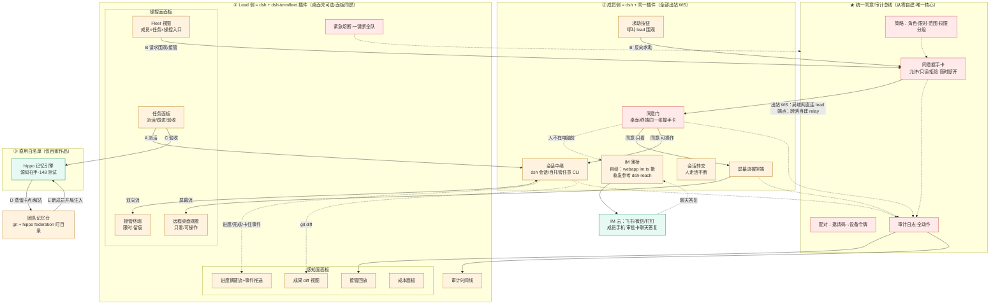

# dsh-termfleet · 主计划（开工前筹备 v1 · 2026-09-19）

> **定位一句话**：纯 dsh 插件形态的团队驾驶舱——lead 与成员同装一个插件，获得跨成员的远程桌面围观、终端/DSH 会话接管、IM 审批、任务面板与团队记忆，全部动作过统一同意/审计总线。
> 生态调研与决策依据：`D:\coding\termfleet-heimdall\docs\DSH-ECOSYSTEM-SCAN-0918.md`（唯一权威调研版）。
> 立项条目：`D:\coding\docs\needs\dsh-termfleet.md`。

---

## 1. 已定决策（D1–D10，均有调研背书）

| # | 决策 | 依据 |
|---|---|---|
| D1 | **纯 dsh 插件**，lead/成员同装，出站 WS 星型连 lead 插件端点；不依赖 Orca/任何外部 app | 用户定调；Orca fork 为另一独立项目线，两线不混（2026-09-19 纠偏） |
| D2 | 包名 **`dsh-termfleet`** | dsh-market 命名惯例（dsh- 前缀可发现性） |
| D3 | **四件套（操控面）：远程会话操控（dsh+任意 CLI，仅会话级）/ IM / 任务面板 / hippo 记忆**。远程桌面（整屏围观/键鼠）于 2026-09-19 出列（隐私边界），降级 backlog | 用户 2026-09-19 两次定调 |
| D4 | 六缺口（感知/交付面）：进度汇报流 / 成果 diff / 会话转交 / 求助按钮 / 接管回放 / 成本面板（+熔断、权限分级） | 同上 |
| D5 | **统一同意/审计总线**是唯一从零核心**：握手卡(允许/只读/拒绝)·限时·角色·全量审计·配对(邀请码→设备令牌)**；桌面与终端共用同一张卡、同一个断开按钮 | 25+ 红海包全是"连自己"，他信治理空白 |
| D6 | 工作量三档：**直用**（仅 hippo——自家作品源码在手）｜**要写·有底**（屏幕流抄 dsh-remote-desktop 先例、PTY 接管搬 termfleet worker.mjs、面板移植 webapp 现成实现、IM 薄桥搬 webapp im.ts）｜**从零**（总线） | 2026-09-19 口径澄清 |
| D7 | **生态件只参考不直用**（用户定调 2026-09-19）：IM 桥自研薄层（出站底子=webapp im.ts 飞书/钉钉；收方向参考 dsh-reach/dsh-im-feishu 的长连接做法）；桌面壳=dsh-plugin-desktop 降级为用户自选外部便利件，**非产品依赖**（面板在 dsh web 浏览器形态本就全）；直用白名单仅 hippo | 供应链安全（信任类产品不背第三方断更风险）+ dsh 0.1.x 快跑版本风险 |
| D8 | 远程操控范围：dsh 会话（插件/宿主 API）+ 插件自托管任意 CLI（PTY host，worker.mjs 思路） | 用户需求"操控 cli" |
| D9 | 团队记忆层：个人层=hippo 原样（~/.hippo 私有）；共享层=git 仓 + hippo federation 盯目录（待 M0 验证） | hippo federation 是跨 agent 文件同步，恰好可复用 |
| D10 | 成员机零入站端口；跨网场景自建 relay（M2 后）；传输局域网 WS、M3 前决定是否上 TLS | worker.mjs 安全基线延续 |

## 2. 最终架构图（三色工作量标注）

**图例**：绿=直用（仅 hippo 自家）｜橙=要写·有底（移植或照先例）｜红=从零自建（仅总线族）。
**依赖纪律（D7）**：生态件只参考不直用；桌面壳=dsh-plugin-desktop 为用户自选外部便利件（非依赖，面板在 dsh web 浏览器形态本就全）。
**动线**：A 派活 → B 请求/B' 求助 → 同意（人不在走 IM）→ 操控/围观 → C 验收 → D 蒸馏 → E 注入。

## 3. 里程碑与验收（每步：真测+录屏+笔记登记）

| 里程碑 | 范围 | 验收标准（全部真测） |
|---|---|---|
| **M0 探针 PoC**（1-2 天） | ①一次性探针插件实测两命门：**dsh 会话输入/输出流能否拿到**、**插件内 spawn PTY 行不行**；②读 dsh-remote-desktop 源码确认截屏+键鼠实现路线；③hippo federation 盯 git 仓验证（团队记忆层可行性） | 三项各有实测结论+证据（日志/截图）落档；架构假设全部钉死或触发 D8/D9 降级 |
| **M1 总线+接管最小闭环** | 配对（邀请码→令牌）、握手卡、出站 WS、dsh 会话/PTY 中继、双向流、限时、审计日志 | 两台真机：lead 发起→成员同意→lead 实际敲进成员会话看到回显；拒绝/超时/断开三条路径各测一遍；全程录屏 |
| **M2 会话操控+IM 审批** | 会话级远程完善（答权限卡透传/发指令/进度摘要）、只看/可操作两档、IM 桥接审批卡、求助按钮（**屏幕流出列**） | 手机 IM 答复一个接管请求生效；只看档 lead 输入被禁；dsh 会话权限卡代答实测；录屏 |
| **M3 任务+记忆+感知面** | 任务面板、验收→蒸馏→团队记忆闭环、进度流、diff、回放、成本、熔断、权限分级 | 全流程录屏：派活→开工→卡住事件推送→接管解卡→验收→教训进团队仓→新成员开局注入命中；回放可放；熔断一键全断 |

降级路径：M0 若"dsh 会话流拿不到"→ 改走官方 dsh-api-gateway Remote 协议（架构微调，D8 注）；若"federation 盯 git 不可行"→ 团队仓改文件同步任务（D9 注）。

## 4. 复用清单（精确到包 · D7 依赖纪律后）

| 用途 | 来源 | 用法 |
|---|---|---|
| 记忆引擎 | 本地 dsh-hippo v0.5.0 | **直用**（自家作品，白名单唯一项） |
| IM 桥 | 自研薄层；底子=termfleet webapp `im.ts`（飞书/钉钉出站已有） | **自研**；收方向（聊天答复）参考 dsh-reach / dsh-im-feishu 长连接做法 |
| 桌面壳 | dsh-plugin-desktop | **非依赖**：用户自选外部件，README 推荐一句 |
| 屏幕流 | dsh-remote-desktop（本地代理 8090+屏幕/键鼠） | **只读源码参考**，实现自写 |
| PTY 接管逻辑 | termfleet-heimdall `worker/worker.mjs` + `server/src/pty-host.ts` | 自家代码移植 |
| 面板底子 | termfleet-heimdall webapp：cpTailSummary/taskDiff/checkpoints/usage | 自家代码移植 |

## 5. 风险表

| 风险 | 等级 | 缓解 |
|---|---|---|
| dsh 会话流不可达（M0 命门①） | 高 | 官方 dsh-api-gateway/Typert Remote 协议兜底 |
| lead 单点（关机全队瘫痪/数据丢） | 中 | 任务+审计定时 git 快照；lead 离线成员本地照跑（会话本就在成员机） |
| 上游 dsh 版本漂移（0.1.x 快迭代） | 中 | 版本门控声明；CI 对 0.1.5-rc.1 与最新 rc 双测 |
| worker.mjs 移植进 Cordis 生命周期的水土不服 | 低-中 | M1 第一周即做真机双机验证 |

## 6. 环境前置

- dsh 0.1.5-rc.1+（本机已装）；Node ≥22（插件宿主随 dsh）
- 两台真机（lead/成员）用于 M1 起的所有验收——不接受单机模拟冒充
- 团队记忆仓：新建空 git 仓（M3 前）
- 笔记登记：沿用 termfleet-heimdall `.agents/notes` 体系（proposed→implemented），每里程碑验收后登记

## 7. 开工即执行（M0 任务细单）

1. `dsh-plugin/plugins/dsh-termfleet/` 起插件骨架（package.json + cordis.patch.yml 最小半）
2. 探针 ①：宿主 ctx 上找 session/会话输入输出 seam（读 @deepseek-ai/dsh-agent 事件词汇表 + dsh-api-gateway 源码），实测读一条会话流+写入一条输入
3. 探针 ②：插件内 spawn PTY（node-pty/@lydell/node-pty）跑 pwsh，回显经 webServer 路由输出
4. 读 dsh-remote-desktop 源码：截屏 API 选型（截图周期/增量？键鼠注入方式）、本地代理结构，落一页实现笔记
5. hippo federation 指向临时 git 仓，push/pull 后确认自动入库
6. 全部结论回填本 PLAN 第 1/3 节并登记笔记

## 8. M0 实测结论（2026-09-19）

> 三条 M0 验收全部完成，**D8/D9 降级路径均未触发**，M1 按原架构起步。证据留档：`D:\coding\tmp\termfleet-m0-probe\`（boot/curl/dump-config 全套日志）、本插件 `docs/m0-screen-notes.md`、termfleet-heimdall `.agents/notes/implemented/architecture/2026-09-19-m0-probe-verdicts.md`。

| # | 命门 | 判定 | 一句话证据 |
|---|---|---|---|
| 1 | 骨架合成 | **通** | `dsh --profile web --patch …\cordis.patch.yml --dump-config` exit 0，合成树出现 termfleet 覆盖层（termfleet-dump-web.json:579-582），lib 产物 ESM 装载 ok |
| 2 | 会话流读 | **通** | 真 web 宿主 boot（127.0.0.1:3180）插件全局 listener 收全量事件 sessionEventCount=17（seq0-16 完整 turn），snapshotEvents() 交叉验证一致 |
| 3 | 会话流写 | **通** | POST 路由 → agent.followup 注入文本以 user/message(seq8) 落会话日志并回显（延迟 661/451ms），假 provider 快败零 API 费用 |
| 4 | PTY | **通** | @lydell/node-pty@1.2.0-beta.15 装插件自身 node_modules（不碰 profile），宿主内 file:// 动态 import spawn pwsh：banner 97ms、stdin 写回显 35ms |
| 5 | 屏幕流路线 | **部分** | dsh-remote-desktop 源码笔记落档（GDI+ 截屏 worker + user32 P/Invoke 键鼠 + 五坑清单，见 `docs/m0-screen-notes.md`）路线已钉死；截屏/注入未在本插件栈内实跑，首证留待 M2 自写实现 |
| 6 | 记忆仓 | **通** | git 仓 + hippo federation（HIPPO_DATA_DIR 沙箱）双步真测：scan 入库 6+3 条、新成员 clone 全量 created 9/9、recall top-1 命中（score 1.07）、重扫幂等（created 0 / reinforced 9） |

M0 副产物钉死的 M1 约束：自建会话必须传 `meta.cwd`（否则败于 `{{cwd}}` 变量）；已持久化会话同 id 重建抛 SessionAlreadyExistsError；插件 webServer 直挂路由绕过 launch token，**上总线前必须先加同意/鉴权门**；title-LLM 可能发网络请求（需绝对零费用时关掉）。

## 9. 前后端分工与节奏（2026-09-19 补）

插件内物理位置：**前端=client 半**（React 面板挂 dsh web GUI，参照 hippo `/dsh-hippo/app` 挂法，exports ./client）；**后端=host 半**（webServer 路由+WS+PTY+总线+审计，跑在宿主进程内）。

| 里程碑 | 后端（host 半） | 前端（client 半） |
|---|---|---|
| M0 ✅ | 全部（探针/拆源码/记忆仓） | 无 |
| M1 总线+接管 | **大头**：鉴权门（第一件事）、配对、握手卡状态机、lead WS 端点、成员出站 WS、会话/PTY 中继、限时、审计 | **最小可用**：握手卡弹窗、最简接管终端（不做视觉） |
| M2 围观+IM | 屏幕流 worker（照五坑清单）、键鼠注入、IM 薄桥（im.ts 出站+收方向长连接） | 桌面观看器（流渲染+两档+水印）、IM 审批卡模板、求助按钮 |
| M3 任务+记忆+感知 | 任务库、验收→蒸馏管线（接 hippo）、进度摘要、事件推送、diff/回放/成本 API | **大头**：Fleet 视图/任务面板/进度流/diff/回放/成本/审计时间线/权限（全产品 80% 界面） |

节奏：**后端负重在前（M1 最大），前端负重在后（M3 最大）**；每步前端只做"动线能走通"，视觉与动线统一在 M3 尾部一次收口。设计插两个点：**M1 开工前半天**出全量面板低保真布局（信息架构一次定完），**M3 中段**视觉动线收口。

## 10. 前端审美风险缓解（2026-09-19 补，Heimdall 教训内化）

前端自由度压缩到只剩信息架构，视觉不吃自研审美：

1. **视觉继承宿主**：client 半全部用 `@deepseek-ai/dsh-client-ui-primitives` 官方原子组件 + 官方 theme（亮暗/系统跟随），色板/字体/间距/控件与 dsh 本体一致——面板与宿主长在一起，不自造视觉（先例：hippo 工作台、社区 task-board）。
2. **布局抄成熟答案**：Fleet/任务面板/接管终端布局基于 Orca pane/tab 体系（源码已读）、VSCode 侧栏+面板、Linear 看板拼装，不发明新布局。
3. **低保真 2-3 版用户圈点定稿**：M1 开工前出静态 HTML mockup（信息密度高/中/低三版），用户挑一版改满意后才动代码。
4. **每里程碑截图过目制**：M1/M2/M3 前端件先截图给用户过目，当期改，不攒尾。

M1 前置侦察追加一项：读 dsh-client-ui-primitives 源码 + 社区面板（task-board/git-graph）挂载惯例，产出"设计基线"笔记（可用原子清单/布局惯例/面板挂法），作为低保真的输入。
