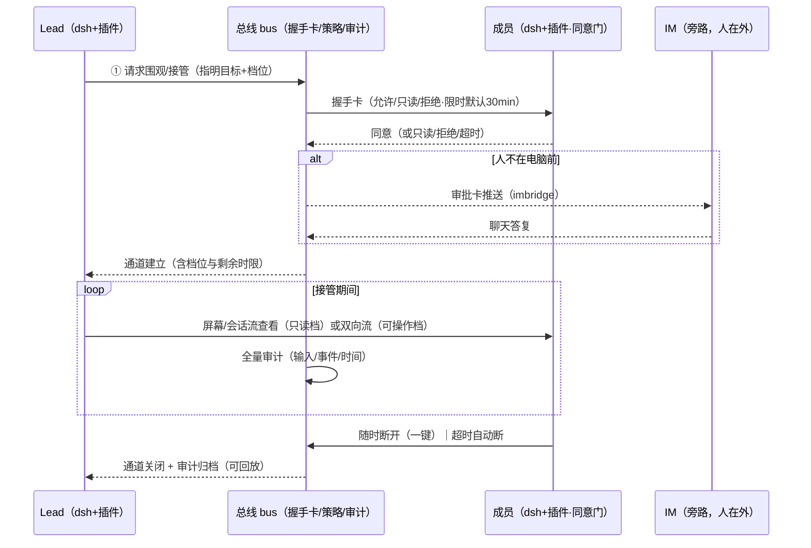

# 同意握手 → 远程围观/接管

产品主线动线（PLAN 第 2 节架构图 A/B/C 三步）。

```mermaid
sequenceDiagram
    participant L as Lead（dsh+插件）
    participant B as 总线 bus（握手卡/策略/审计）
    participant M as 成员（dsh+插件·同意门）
    participant I as IM（旁路，人在外）
    L->>B: ① 请求围观/接管（指明目标+档位）
    B->>M: 握手卡（允许/只读/拒绝·限时默认30min）
    M-->>B: 同意（或只读/拒绝/超时）
    alt 人不在电脑前
        B-->>I: 审批卡推送（imbridge）
        I-->>B: 聊天答复
    end
    B-->>L: 通道建立（含档位与剩余时限）
    loop 接管期间
        L->>M: 屏幕/会话流查看（只读档）或双向流（可操作档）
        B->>B: 全量审计（输入/事件/时间）
    end
    M->>B: 随时断开（一键）｜超时自动断
    B-->>L: 通道关闭 + 审计归档（可回放）
```

## 关键规则
- 拒绝无需理由；同意/拒绝均入审计
- 桌面与终端共用同一张卡、同一个断开按钮
- 成员侧求助按钮=反向：成员发起→lead 收到预填围观请求（自己批自己发）
- 熔断：lead 一键断全队通道（紧急止损）
