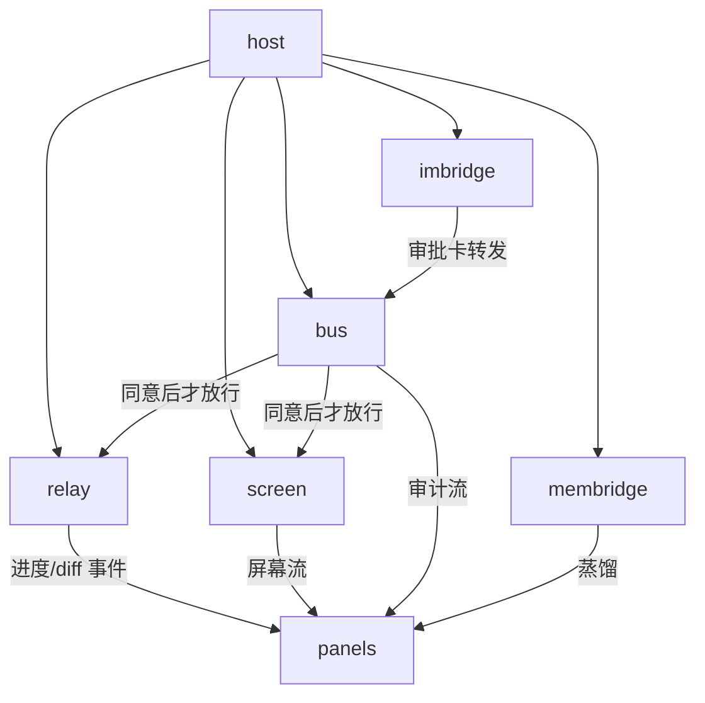

# 模块总览

> dsh-termfleet 插件模块地图。权威主计划见根目录 [PLAN.md](../../../PLAN.md)（决策 D1-D10/架构图/里程碑）；本库管活文档：SPEC 同步、错题、决策、流程、状态。

## 模块列表

| 模块 | 职责 | 入口点 | SPEC 文件 |
|------|------|--------|-----------|
| host | 宿主挂载：cordis patch、路由注册、鉴权门、生命周期 | src/index.ts（lib/ 镜像为装载物） | [host.md](host.md) |
| bus | 统一同意/审计总线：握手卡/配对/策略/审计/熔断（唯一从零核心） | src/bus/（M1） | [bus.md](bus.md) |
| relay | 会话中继：dsh 会话流 seam + 自托管 PTY | src/relay/（M1） | [relay.md](relay.md) |
| panels | client 半面板：Fleet/任务/围观/接管/审计/进度/diff/成本/回放 | src/client.ts + web/ | [panels.md](panels.md) |
| screen | 屏幕流：截屏 worker + 键鼠注入 | src/screen/（M2） | [screen.md](screen.md) |
| imbridge | IM 薄桥：出站 + 收方向长连接 | src/im/（M2） | [imbridge.md](imbridge.md) |
| membridge | 记忆桥：hippo 对接 + 团队仓 | src/memory/（M3） | [membridge.md](membridge.md) |

## 依赖关系图

核心约束：relay/screen 的一切远程动作必须经 bus 同意（PLAN D5）；成员机零入站端口（D10）。

## 目录与模块的映射

| 目录 | 对应模块 | 说明 |
|------|----------|------|
| src/index.ts + lib/ | host | M0 起存在；无构建管线前 src/lib 双写同步 |
| src/bus/ | bus | M1 开工 |
| src/relay/ | relay | M1；PTY 依赖已装 @lydell/node-pty@1.2.0-beta.15 |
| src/client.ts + web/ | panels | M1 起；参照 dsh-hippo web/ 挂法 |
| src/screen/ | screen | M2；先例笔记 docs/m0-screen-notes.md |
| src/im/ | imbridge | M2；出站底子 termfleet webapp im.ts |
| src/memory/ | membridge | M3；HIPPO_DATA_DIR 沙箱已验 |
